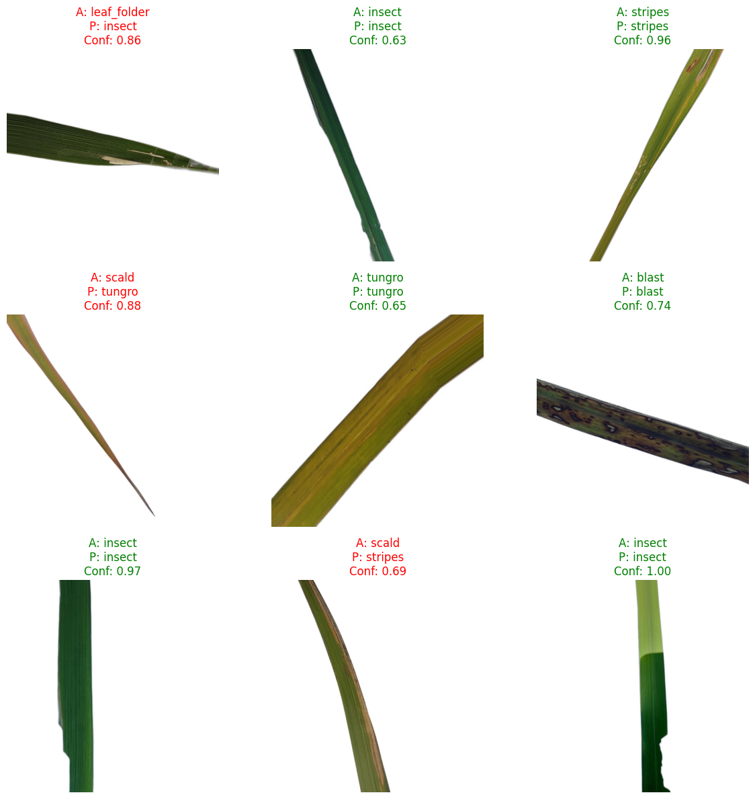
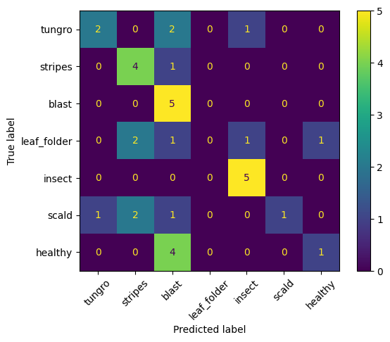

<p align="center">
  
  
  
  
  
</p>

<h1 align="center">🌾 Rice Leaf Disease Detection</h1>

<p align="center">
A deep learning system that identifies rice leaf diseases from images — and rejects non-rice images — using transfer learning with <b>MobileNetV2</b>.
</p>

---

## 📑 Table of Contents

- [Problem Statement](#-problem-statement)
- [Overview](#-overview)
- [Model Architecture](#-model-architecture)
- [Dataset](#-dataset)
- [How It Works](#️-how-it-works)
- [Results](#-results)
- [Project Structure](#-project-structure)
- [How to Run](#-how-to-run)
- [Tech Stack](#️-tech-stack)
- [Future Improvements](#-future-improvements)
- [Author](#-author)

---

## 🎯 Problem Statement

Rice crop diseases cause major yield losses for farmers, especially where expert diagnosis isn't easily accessible. This project provides an automated, image-based way to detect common rice leaf diseases early — while also being robust enough to reject images that aren't rice leaves at all, reducing false diagnoses.

---

## 📌 Overview

The model classifies rice leaf images into disease categories and includes a **"Background" class** so it doesn't falsely diagnose non-rice plants. It's built on a lightweight architecture suitable for real-time, mobile, or web deployment.

---

## 🧠 Model Architecture

- **Base Model:** MobileNetV2 (pre-trained on ImageNet, fine-tuned on last 30 layers)
- **Input Size:** 160 × 160 pixels
- **Pooling:** GlobalAveragePooling2D
- **Regularization:** Batch Normalization + Dropout
- **Output Layer:** Dense layer with Softmax activation

---

## 📂 Dataset

Combined from two public sources:

**Rice Disease Classes:**
| Class | Description |
|---|---|
| Blast | Fungal disease affecting leaves and grains |
| Healthy | No disease present |
| Insect | Insect-related damage |
| Scald | Leaf scald disease |
| Stripes | Bacterial/fungal stripe disease |
| Tungro | Viral disease spread by leafhoppers |

**Background (Non-Rice) Class:**
Leaves from other plants (tomato, potato, pepper) — so the model can reject non-rice inputs instead of forcing a wrong disease label onto them.

---

## ⚙️ How It Works

1. **Preprocessing** — image resized to 160×160, pixel values normalized (0–1)
2. **Data Augmentation** — random rotation, zoom, and horizontal flip during training
3. **Feature Extraction** — MobileNetV2 extracts leaf texture, color, and disease-pattern features
4. **Classification** — final dense layer outputs a probability per class via Softmax

Example prediction output:
```json
{
  "label": "blast",
  "confidence": 0.95
}
```

---

## 📊 Results

Trained for 25 epochs with data augmentation:

| Metric | Value |
|---|---|
| Final Training Accuracy | **88.8%** |
| Final Validation Accuracy | **82.0%** |
| Training Loss | 0.30 |
| Validation Loss | 0.53 |

### 🖼️ Sample Predictions

Green titles = correct prediction, red = incorrect (with confidence score shown):

<p align="center">
  
</p>

### 🔢 Confusion Matrix

<p align="center">
  
</p>

---

## 📁 Project Structure

```
rice-leaf-disease-detection/
│
├── rice-leaf-disease-detection.ipynb   # Full training, evaluation & visualization pipeline
├── random_predictions.png              # Sample model predictions on rice leaves
├── confusion_matrix.png                # Per-class confusion matrix
└── README.md                           # Project documentation
```

---

## ▶️ How to Run

1. Clone this repository:
   ```bash
   git clone https://github.com/mawais37/rice-leaf-disease-detection.git
   cd rice-leaf-disease-detection
   ```
2. Install dependencies:
   ```bash
   pip install tensorflow numpy matplotlib scikit-learn
   ```
3. Open and run the notebook:
   ```bash
   jupyter notebook rice-leaf-disease-detection.ipynb
   ```
   > Note: This notebook was originally trained on Kaggle with GPU acceleration. Update the dataset paths at the top of the notebook to match your local or Kaggle environment.

---

## 🛠️ Tech Stack

- **Language:** Python
- **Deep Learning:** TensorFlow / Keras
- **Model:** MobileNetV2 (Transfer Learning)
- **Evaluation:** scikit-learn (confusion matrix)
- **Visualization:** Matplotlib

---

## 🚀 Future Improvements

- [ ] Increase dataset size per class to reduce the train/validation accuracy gap
- [ ] Export model to TFLite for mobile deployment
- [ ] Add Grad-CAM visualizations to explain model predictions
- [ ] Deploy as a simple web app for live testing

---

## 👤 Author

**Muhammad Awais**
Python Developer | Data Analyst | AI/ML Enthusiast
🔗 [GitHub](https://github.com/mawais37)
